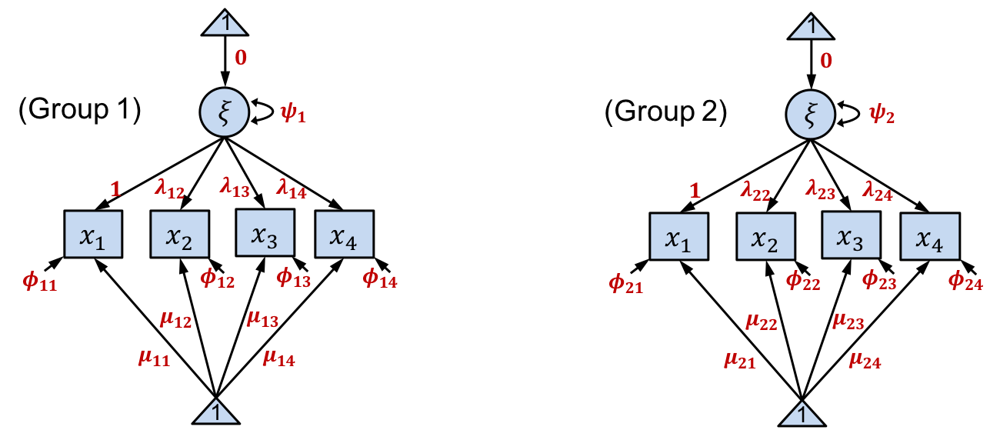
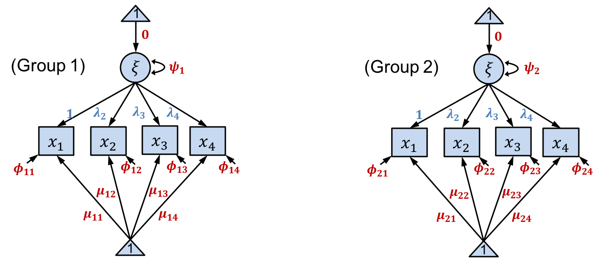
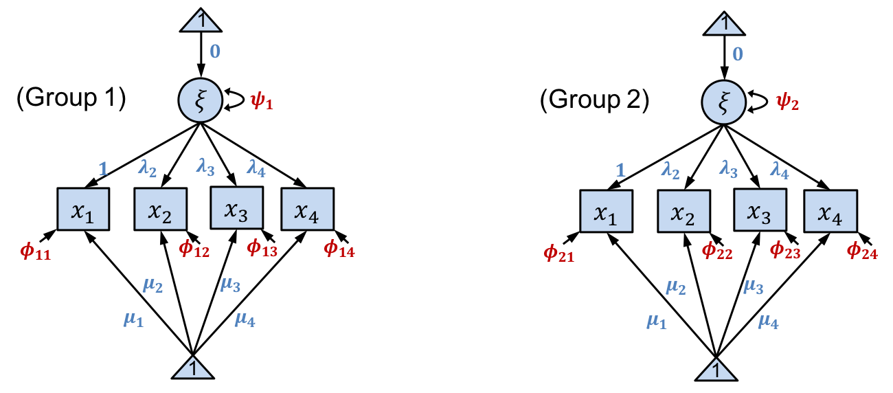

## 0. Setups
Load require packages. 
```{r message=FALSE, warning=FALSE}
library(tidyverse)
library(DiagrammeR)
library(lavaan)
library(semTools)
```

## 1. Mediation Analysis: Path Analysis
### Read Data
Data file `protest.txt` is read in, and variable names are given.
```{r}
protest.dat <- read.table("Data/protest.txt")
colnames(protest.dat) <- c("sexism", "liking", "respappr", "protest")
```

Data are from the sex discrimination study (Garcia et al., 2010) in Muthen, Muthen, & Asparouhov (2016, p.72), as well as Hayes (2013).
  - Subjects (129 females) were presented a story of how a female attorney lost a promotion to a less qualified male due to discriminatory actions.  
  - Subjects were randomly assigned to two different scenarios; (1) the female attorney takes no action, and (2) the female attorney protests.  

Variables:  
  - Intervention variable (0=no protest. 1=protest) (protest)  
  - How well the subject likes the female attorney (liking: outcome variable)  
  - Perceived appropriateness of the response of the female attorney (respappr: mediator).  
```{r}
protest.dat
```
```{r}
protest.dat %>% select(-sexism) %>% psych::describe(fast=T)
```

### Model
Our interst is to investigate an effect of the intervention variable (protest) to the outcome variable (liking). However, it is suspected that the effectis mediated by perceived response appropriateness (respappr).  

The model can be graphically shown in a path diagram below.  
```{r echo=FALSE}
library(DiagrammeR)
grViz("
digraph SEM {
graph [layout = neato,
       outputorder = edgesfirst]
node [shape = rectangle]
v1 [pos = '-1.5, 0!', label = 'Protest (x)']
v2 [pos = '   0, 1!', label = 'Respappr (m)']
v3 [pos = ' 1.5, 0!', label = 'Liking (y)']

v1 -> v2 [arrowsize = 0.5];
v1 -> v3 [arrowsize = 0.5];
v2 -> v3 [arrowsize = 0.5];
}
")
```
### Specifications for lavaan
Build a model for `lavaan`. See http://lavaan.ugent.be/tutorial/cfa.html for more about `lavaan`.
```{r}
MA.mod01 <- '
liking ~ b1*respappr + protest
respappr ~ g1*protest
prolik := b1*g1
'
```

Run the model with bootstrap specification.
```{r}
MA.fit01 <- sem(MA.mod01, data=protest.dat, se="boot", bootstrap=1000)
```

View summary results.
```{r}
summary(MA.fit01)
```

Extract model parameter estimates and 95% CIs.
```{r}
parameterEstimates(MA.fit01, ci=T, level=.95, zstat=F, pvalue=F)
```

Extract standardized estimates and 95% CIs.
```{r}
standardizedSolution(MA.fit01, ci=T, level=.95, zstat=F, pvalue=F)
```

## 2. Measurement Invariant Tests: Confirmatory Factor Analysis
#### Configural Invariance
Only factor structure is the same between groups.  

{width=450}  

#### Metric Invariance (a.k.a. Weak Invariance)
In addition to factor structure, factor loadings are the same between groups.  

{width=450}  

#### Scalar Invariance (a.k.a. Strong Invariance)
In addition to factor structure, factor loadins and intercepts are the same between groups.  

{width=450}  

#### Factor-mean Invariance
In addition to the scalar invariance, factor means are the same between groups.  

{width=450}  

### Data
Holzinger & Swineford (1939) data
301 7th and 8th grade children from two schools, measured on mental ability test scores on 9 items measuring 3 areas:  
    - Visual (x1, x2, x3)  
    - Textual (x4, x5, x6)  
    - Speed (x7, x8, x9)

This dataset is part of `lavaan` package.
```{r}
data("HolzingerSwineford1939")
```

```{r}
HolzingerSwineford1939 %>% 
  select(x1, x2, x3, x4, x5, x6, x7, x8, x9) %>% 
  psych::describe(fast=T)
```
```{r}
HolzingerSwineford1939 %>% 
  select(school) %>% 
  sjmisc::frq()
```

### Setting up a baseline model for lavaan
Let’s say our interest is to investigate if the 9-item test was invariant between the two schools.  

Measurement invariance tests are much more manageable by `lavaan` on R. Set up the baseline 3-factor CFA model.
```{r}
MI.mod01 <- '
visual =~ x1+x2+x3
textual =~ x4+x5+x6
speed =~ x7+x8+x9
'
```

### Configural-invariance Model
Set up the model.
```{r}
configural <- measEq.syntax(configural.model = MI.mod01,
                            data = HolzingerSwineford1939,
                            group = "school",
                            group.equal = "configural")
configural.mod <- as.character(configural)
```
Run the model
```{r}
configural.fit <- cfa(configural.mod, 
                    data=HolzingerSwineford1939, 
                    group = "school")
```
View result summary
```{r}
summary(configural.fit)
```
Extract fit indices.
```{r}
configural.fit.idx <- 
  fitmeasures(configural.fit, 
              fit.measures = c("chisq", "df", "pvalue", 
                               "rmsea", "cfi", "tli"))
```

### Metric-invariance Model.
Set up the model.
```{r}
metric <- measEq.syntax(configural.model = MI.mod01,
                      data = HolzingerSwineford1939,
                      group = "school",
                      group.equal = "loadings")
metric.mod <- as.character(metric)
```
Run the model.
```{r}
metric.fit <- cfa(metric.mod, 
                    data=HolzingerSwineford1939, 
                    group = "school")
```
View result summary.
```{r}
summary(metric.fit)
```
Extract fit indices.
```{r}
metric.fit.idx <- 
  fitmeasures(metric.fit, 
              fit.measures = c("chisq", "df", "pvalue", 
                               "rmsea", "cfi", "tli"))

```

### Scalar-invariance Model.
Set up the model.
```{r}
scalar <- measEq.syntax(configural.model = MI.mod01,
                      data = HolzingerSwineford1939,
                      group = "school",
                      group.equal = c("loadings", "intercepts"))
scalar.mod <- as.character(scalar)
```
Run the model.
```{r}
scalar.fit <- cfa(scalar.mod, 
                    data=HolzingerSwineford1939, 
                    group = "school")
```
View the result summary.
```{r}
summary(scalar.fit)
```
Extract the fit indices.
```{r}
scalar.fit.idx <- 
  fitmeasures(scalar.fit, 
              fit.measures = c("chisq", "df", "pvalue", 
                               "rmsea", "cfi", "tli"))
```

### Factor-mean-invariance Model.
Set up the model.
```{r}
means <- measEq.syntax(configural.model = MI.mod01,
                      data = HolzingerSwineford1939,
                      group = "school",
                      group.equal = c("loadings", "intercepts", "means"))
means.mod <- as.character(means)
```
Run the model.
```{r}
means.fit <- cfa(means.mod, 
                    data=HolzingerSwineford1939, 
                    group = "school")
```
View the summry results
```{r}
summary(means.fit)
```
Extract the fit indices
```{r}
means.fit.idx <- 
  fitmeasures(means.fit, 
              fit.measures = c("chisq", "df", "pvalue", 
                               "rmsea", "cfi", "tli"))

```

### Combine the fit indices from the 4 models.
```{r}
rbind(configural.fit.idx,
      metric.fit.idx,
      scalar.fit.idx,
      means.fit.idx)
```

### Conduct Chi-square difference test between models.
```{r}
anova(configural.fit, metric.fit)
anova(metric.fit, scalar.fit)
anova(scalar.fit, means.fit)
```


